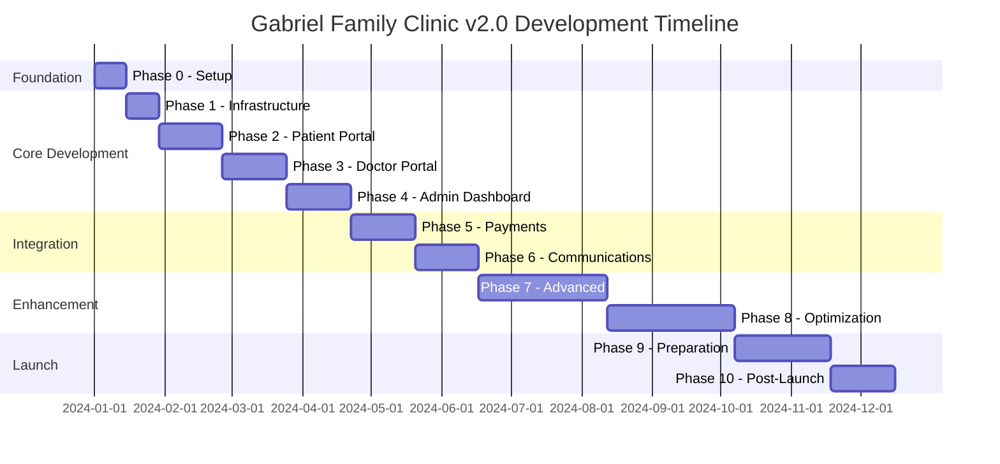

# Master Execution Plan
## Gabriel Family Clinic v2.0 - Comprehensive Development Roadmap

**Version**: 1.0.0  
**Date**: November 2024  
**Timeline**: 12 Months  
**Team Size**: 3 Developers  
**Approach**: Incremental Value Delivery  

---

## Table of Contents
1. [Executive Overview](#1-executive-overview)
2. [Development Phases Timeline](#2-development-phases-timeline)
3. [Phase 0: Foundation & Setup](#phase-0-foundation--setup-weeks-1-2)
4. [Phase 1: Core Infrastructure](#phase-1-core-infrastructure-weeks-3-6)
5. [Phase 2: Patient Portal MVP](#phase-2-patient-portal-mvp-weeks-7-10)
6. [Phase 3: Doctor Portal](#phase-3-doctor-portal-weeks-11-14)
7. [Phase 4: Admin Dashboard](#phase-4-admin-dashboard-weeks-15-18)
8. [Phase 5: Payment Integration](#phase-5-payment-integration-weeks-19-22)
9. [Phase 6: Communication Features](#phase-6-communication-features-weeks-23-26)
10. [Phase 7: Advanced Features](#phase-7-advanced-features-weeks-27-34)
11. [Phase 8: Optimization & Polish](#phase-8-optimization--polish-weeks-35-42)
12. [Phase 9: Launch Preparation](#phase-9-launch-preparation-weeks-43-48)
13. [Phase 10: Post-Launch Support](#phase-10-post-launch-support-weeks-49-52)
14. [Risk Mitigation Strategy](#risk-mitigation-strategy)
15. [Success Metrics](#success-metrics)

---

## 1. Executive Overview

### 1.1 Development Philosophy
```typescript
const DEVELOPMENT_PRINCIPLES = {
  deliverables: "Working software every 2 weeks",
  testing: "Test as you build, not after",
  documentation: "Document for the next developer",
  review: "Code review before merge",
  deployment: "Deploy to preview on every PR",
  feedback: "User testing every phase"
};
```

### 1.2 Phase Strategy
Each phase is designed to:
- **Deliver standalone value** - Can be deployed independently
- **Build incrementally** - Each phase extends the previous
- **Minimize dependencies** - Reduce blocking between developers
- **Enable parallel work** - Multiple developers can work simultaneously
- **Include testing** - Built-in quality assurance

### 1.3 Team Allocation
```typescript
const TEAM_STRUCTURE = {
  developer_1: {
    name: "Lead Developer",
    focus: ["Architecture", "Backend", "Database", "DevOps"],
    phases: ["0", "1", "5", "7", "9"]
  },
  developer_2: {
    name: "Frontend Developer",
    focus: ["UI/UX", "Patient Portal", "Doctor Portal"],
    phases: ["2", "3", "6", "8"]
  },
  developer_3: {
    name: "Full-Stack Developer",
    focus: ["Admin Portal", "Integrations", "Testing"],
    phases: ["4", "5", "6", "7", "10"]
  }
};
```

---

## 2. Development Phases Timeline



---

## Phase 0: Foundation & Setup (Weeks 1-2)

### Description
Establish the development environment, project structure, and core configurations. This phase sets up all the tools, accounts, and basic infrastructure needed for the entire project.

### Objectives
- Set up development environment
- Configure cloud services
- Establish coding standards
- Create project skeleton
- Set up CI/CD pipeline

### Team Assignment
- **Lead**: Developer 1 (Lead Developer)
- **Support**: Developer 2 & 3

### Deliverables Checklist

#### Project Setup Files
- [ ] **`package.json`** - Project dependencies and scripts
```json
{
  "name": "gabriel-family-clinic-v2",
  "version": "0.1.0",
  "private": true,
  "scripts": {
    "dev": "next dev",
    "build": "next build",
    "start": "next start",
    "lint": "next lint",
    "test": "jest",
    "test:e2e": "playwright test",
    "db:push": "prisma db push",
    "db:migrate": "prisma migrate dev",
    "type-check": "tsc --noEmit"
  },
  "dependencies": {
    "next": "^13.5.0",
    "@supabase/supabase-js": "^2.38.0",
    "@mantine/core": "^7.0.0",
    "@mantine/hooks": "^7.0.0",
    "react": "^18.2.0",
    "react-dom": "^18.2.0",
    "zustand": "^4.4.0",
    "react-hook-form": "^7.47.0",
    "zod": "^3.22.0",
    "@trpc/client": "^10.43.0",
    "@trpc/server": "^10.43.0",
    "@trpc/react-query": "^10.43.0",
    "dayjs": "^1.11.10"
  }
}
```

#### Configuration Files
- [ ] **`.env.example`** - Environment variables template
```env
# App
NEXT_PUBLIC_APP_URL=http://localhost:3000
NEXT_PUBLIC_APP_NAME="Gabriel Family Clinic"

# Supabase
NEXT_PUBLIC_SUPABASE_URL=your_supabase_url
NEXT_PUBLIC_SUPABASE_ANON_KEY=your_anon_key
SUPABASE_SERVICE_ROLE_KEY=your_service_key

# External Services (Phase 5+)
STRIPE_SECRET_KEY=
STRIPE_PUBLISHABLE_KEY=
TWILIO_ACCOUNT_SID=
TWILIO_AUTH_TOKEN=
RESEND_API_KEY=
```

- [ ] **`next.config.js`** - Next.js configuration
```javascript
/** @type {import('next').NextConfig} */
const nextConfig = {
  reactStrictMode: true,
  images: {
    domains: ['your-supabase-url.supabase.co'],
  },
  experimental: {
    serverActions: true,
  },
};

module.exports = nextConfig;
```

- [ ] **`tsconfig.json`** - TypeScript configuration
```json
{
  "compilerOptions": {
    "target": "es5",
    "lib": ["dom", "dom.iterable", "esnext"],
    "allowJs": true,
    "skipLibCheck": true,
    "strict": true,
    "forceConsistentCasingInFileNames": true,
    "noEmit": true,
    "esModuleInterop": true,
    "module": "esnext",
    "moduleResolution": "node",
    "resolveJsonModule": true,
    "isolatedModules": true,
    "jsx": "preserve",
    "incremental": true,
    "baseUrl": ".",
    "paths": {
      "@/*": ["src/*"],
      "@/components/*": ["src/components/*"],
      "@/lib/*": ["src/lib/*"],
      "@/hooks/*": ["src/hooks/*"],
      "@/types/*": ["src/types/*"]
    }
  }
}
```

- [ ] **`tailwind.config.js`** - Tailwind CSS configuration
```javascript
module.exports = {
  content: ['./src/**/*.{js,ts,jsx,tsx,mdx}'],
  theme: {
    extend: {
      colors: {
        primary: {
          50: '#fff5f5',
          500: '#ff6b6b',
          600: '#ff5252',
          700: '#ff3838',
        },
        secondary: {
          500: '#4ecdc4',
        },
      },
      fontSize: {
        'base': '18px', // Larger base for elderly
      },
    },
  },
  plugins: [],
};
```

- [ ] **`.prettierrc`** - Code formatting rules
- [ ] **`.eslintrc.json`** - Linting rules
- [ ] **`.gitignore`** - Git ignore patterns

#### GitHub Setup
- [ ] **`.github/workflows/ci.yml`** - CI pipeline
```yaml
name: CI
on:
  push:
    branches: [main, develop]
  pull_request:
    branches: [main, develop]

jobs:
  test:
    runs-on: ubuntu-latest
    steps:
      - uses: actions/checkout@v3
      - uses: actions/setup-node@v3
        with:
          node-version: '18'
      - run: npm ci
      - run: npm run lint
      - run: npm run type-check
      - run: npm run test
      - run: npm run build
```

- [ ] **`.github/pull_request_template.md`** - PR template
- [ ] **`.github/CODEOWNERS`** - Code ownership

#### Documentation
- [ ] **`README.md`** - Project documentation
- [ ] **`docs/setup.md`** - Setup instructions
- [ ] **`docs/architecture.md`** - Architecture overview
- [ ] **`docs/deployment.md`** - Deployment guide

#### Database Setup
- [ ] **`database/schema.sql`** - Initial database schema
```sql
-- Core tables setup
CREATE TABLE IF NOT EXISTS clinics (
  id UUID DEFAULT gen_random_uuid() PRIMARY KEY,
  name VARCHAR(255) NOT NULL,
  address TEXT,
  phone VARCHAR(20),
  email VARCHAR(255),
  created_at TIMESTAMPTZ DEFAULT NOW()
);

CREATE TABLE IF NOT EXISTS users (
  id UUID DEFAULT gen_random_uuid() PRIMARY KEY,
  email VARCHAR(255) UNIQUE NOT NULL,
  phone VARCHAR(20),
  full_name VARCHAR(255) NOT NULL,
  role VARCHAR(50) CHECK (role IN ('patient', 'doctor', 'staff', 'admin')),
  created_at TIMESTAMPTZ DEFAULT NOW()
);
```

#### Project Structure
- [ ] Create folder structure:
```
gabriel-family-clinic-v2/
├── src/
│   ├── pages/
│   ├── components/
│   ├── lib/
│   ├── hooks/
│   ├── styles/
│   ├── types/
│   └── config/
├── public/
├── database/
├── tests/
└── docs/
```

### Success Criteria
- [ ] Local development environment running
- [ ] Supabase project created and connected
- [ ] GitHub repository with CI/CD
- [ ] All team members can run the project locally
- [ ] Basic "Hello World" page deployed to Vercel

---

## Phase 1: Core Infrastructure (Weeks 3-6)

### Description
Build the foundational infrastructure including authentication, database models, API structure, and shared components that all other features will depend on.

### Objectives
- Implement authentication system
- Set up database with RLS
- Create base UI components
- Establish API patterns
- Build layout structure

### Team Assignment
- **Lead**: Developer 1
- **Frontend**: Developer 2
- **Support**: Developer 3

### Deliverables Checklist

#### Authentication System
- [ ] **`src/lib/auth/supabase-client.ts`** - Supabase client setup
```typescript
import { createClient } from '@supabase/supabase-js';

const supabaseUrl = process.env.NEXT_PUBLIC_SUPABASE_URL!;
const supabaseAnonKey = process.env.NEXT_PUBLIC_SUPABASE_ANON_KEY!;

export const supabase = createClient(supabaseUrl, supabaseAnonKey, {
  auth: {
    persistSession: true,
    autoRefreshToken: true,
  },
});
```

- [ ] **`src/lib/auth/auth-context.tsx`** - Authentication context
```typescript
import { createContext, useContext, useEffect, useState } from 'react';
import { User } from '@supabase/supabase-js';
import { supabase } from './supabase-client';

interface AuthContextType {
  user: User | null;
  loading: boolean;
  signIn: (email: string, password: string) => Promise<void>;
  signOut: () => Promise<void>;
}

const AuthContext = createContext<AuthContextType | undefined>(undefined);

export function AuthProvider({ children }: { children: React.ReactNode }) {
  const [user, setUser] = useState<User | null>(null);
  const [loading, setLoading] = useState(true);

  // Implementation...
  
  return (
    <AuthContext.Provider value={{ user, loading, signIn, signOut }}>
      {children}
    </AuthContext.Provider>
  );
}

export const useAuth = () => {
  const context = useContext(AuthContext);
  if (!context) throw new Error('useAuth must be used within AuthProvider');
  return context;
};
```

- [ ] **`src/lib/auth/protected-route.tsx`** - Route protection component
- [ ] **`src/hooks/use-auth.ts`** - Auth hook
- [ ] **`src/lib/auth/permissions.ts`** - Role-based permissions

#### Database Models & Migrations
- [ ] **`database/migrations/001_users.sql`** - Users table
```sql
-- Enable RLS
ALTER TABLE users ENABLE ROW LEVEL SECURITY;

-- Policies
CREATE POLICY "Users can view own profile" ON users
  FOR SELECT USING (auth.uid() = id);

CREATE POLICY "Users can update own profile" ON users
  FOR UPDATE USING (auth.uid() = id);
```

- [ ] **`database/migrations/002_patients.sql`** - Patients table
- [ ] **`database/migrations/003_doctors.sql`** - Doctors table
- [ ] **`database/migrations/004_appointments.sql`** - Appointments table
- [ ] **`database/migrations/005_medical_records.sql`** - Medical records table

#### API Structure
- [ ] **`src/lib/trpc/client.ts`** - tRPC client setup
- [ ] **`src/lib/trpc/server.ts`** - tRPC server setup
- [ ] **`src/lib/trpc/context.ts`** - Request context
- [ ] **`src/lib/trpc/routers/index.ts`** - Root router
```typescript
import { router } from '../server';
import { authRouter } from './auth.router';
import { userRouter } from './user.router';

export const appRouter = router({
  auth: authRouter,
  user: userRouter,
});

export type AppRouter = typeof appRouter;
```

- [ ] **`src/pages/api/trpc/[...trpc].ts`** - tRPC API handler

#### Base UI Components
- [ ] **`src/components/ui/Button.tsx`** - Button component
```typescript
import { ButtonHTMLAttributes, forwardRef } from 'react';
import { cn } from '@/lib/utils';

interface ButtonProps extends ButtonHTMLAttributes<HTMLButtonElement> {
  variant?: 'primary' | 'secondary' | 'outline';
  size?: 'sm' | 'md' | 'lg';
}

export const Button = forwardRef<HTMLButtonElement, ButtonProps>(
  ({ className, variant = 'primary', size = 'md', ...props }, ref) => {
    return (
      <button
        ref={ref}
        className={cn(
          'rounded-lg font-medium transition-colors',
          {
            'bg-primary-500 text-white hover:bg-primary-600': variant === 'primary',
            'bg-secondary-500 text-white hover:bg-secondary-600': variant === 'secondary',
            'border-2 border-gray-300': variant === 'outline',
            'px-3 py-2 text-sm': size === 'sm',
            'px-4 py-3 text-base': size === 'md',
            'px-6 py-4 text-lg': size === 'lg',
          },
          className
        )}
        {...props}
      />
    );
  }
);
```

- [ ] **`src/components/ui/Card.tsx`** - Card component
- [ ] **`src/components/ui/Input.tsx`** - Input component
- [ ] **`src/components/ui/Select.tsx`** - Select component
- [ ] **`src/components/ui/Modal.tsx`** - Modal component
- [ ] **`src/components/ui/Toast.tsx`** - Toast notification
- [ ] **`src/components/ui/LoadingSpinner.tsx`** - Loading indicator

#### Layout Components
- [ ] **`src/components/layout/Layout.tsx`** - Main layout wrapper
- [ ] **`src/components/layout/Header.tsx`** - Site header
- [ ] **`src/components/layout/Navigation.tsx`** - Navigation menu
- [ ] **`src/components/layout/Footer.tsx`** - Site footer
- [ ] **`src/components/layout/Sidebar.tsx`** - Dashboard sidebar

#### Core Pages
- [ ] **`src/pages/_app.tsx`** - App wrapper with providers
- [ ] **`src/pages/_document.tsx`** - Document structure
- [ ] **`src/pages/index.tsx`** - Homepage
- [ ] **`src/pages/404.tsx`** - 404 error page
- [ ] **`src/pages/500.tsx`** - 500 error page

#### Utilities
- [ ] **`src/lib/utils/cn.ts`** - Class name utility
- [ ] **`src/lib/utils/formatters.ts`** - Data formatters
- [ ] **`src/lib/utils/validators.ts`** - Input validators
- [ ] **`src/lib/utils/constants.ts`** - App constants

#### Styling
- [ ] **`src/styles/globals.css`** - Global styles
```css
@tailwind base;
@tailwind components;
@tailwind utilities;

@layer base {
  :root {
    --color-primary: 255 107 107;
    --color-secondary: 78 205 196;
  }
  
  body {
    @apply text-gray-900 bg-gray-50;
    font-size: 18px; /* Larger base for elderly */
  }
}
```

- [ ] **`src/styles/variables.css`** - CSS variables

### Success Criteria
- [ ] Authentication working (login/logout/register)
- [ ] Database connected with RLS policies
- [ ] All base UI components rendered correctly
- [ ] tRPC API responding to requests
- [ ] Layout structure applied to all pages

---

## Phase 2: Patient Portal MVP (Weeks 7-10)

### Description
Build the core patient-facing features including registration, appointment booking, and basic profile management. This phase delivers the first real value to end users.

### Objectives
- Patient registration flow
- Appointment booking system
- Patient dashboard
- Medical records viewing
- Queue status display

### Team Assignment
- **Lead**: Developer 2
- **Backend**: Developer 1
- **Testing**: Developer 3

### Deliverables Checklist

#### Patient Registration
- [ ] **`src/pages/portal/register.tsx`** - Registration page
```typescript
import { useState } from 'react';
import { useForm } from 'react-hook-form';
import { zodResolver } from '@hookform/resolvers/zod';
import { z } from 'zod';

const registrationSchema = z.object({
  fullName: z.string().min(2, 'Name is required'),
  email: z.string().email('Invalid email'),
  phone: z.string().regex(/^[89]\d{7}$/, 'Invalid Singapore phone'),
  nric: z.string().regex(/^[STFG]\d{7}[A-Z]$/, 'Invalid NRIC'),
  dateOfBirth: z.string(),
  password: z.string().min(8, 'Password must be 8+ characters'),
});

export default function RegisterPage() {
  const { register, handleSubmit, formState: { errors } } = useForm({
    resolver: zodResolver(registrationSchema),
  });

  const onSubmit = async (data: any) => {
    // Registration logic
  };

  return (
    <div className="max-w-md mx-auto p-6">
      <h1 className="text-2xl font-bold mb-6">Patient Registration</h1>
      <form onSubmit={handleSubmit(onSubmit)} className="space-y-4">
        {/* Form fields */}
      </form>
    </div>
  );
}
```

- [ ] **`src/pages/portal/login.tsx`** - Patient login page
- [ ] **`src/pages/portal/verify-otp.tsx`** - OTP verification
- [ ] **`src/components/forms/PatientRegistrationForm.tsx`** - Registration form component
- [ ] **`src/lib/services/patient-service.ts`** - Patient service logic

#### Patient Dashboard
- [ ] **`src/pages/portal/index.tsx`** - Patient dashboard
```typescript
export default function PatientDashboard() {
  const { user } = useAuth();
  const { data: appointments } = useAppointments();
  
  return (
    <DashboardLayout>
      <div className="grid grid-cols-1 md:grid-cols-2 lg:grid-cols-3 gap-6">
        <Card>
          <h2>Next Appointment</h2>
          {/* Appointment details */}
        </Card>
        
        <Card>
          <h2>Recent Visits</h2>
          {/* Visit history */}
        </Card>
        
        <Card>
          <h2>Quick Actions</h2>
          <Button>Book Appointment</Button>
          <Button>View Records</Button>
        </Card>
      </div>
    </DashboardLayout>
  );
}
```

- [ ] **`src/components/patient/PatientCard.tsx`** - Patient info card
- [ ] **`src/components/patient/AppointmentSummary.tsx`** - Appointment summary
- [ ] **`src/components/patient/QuickActions.tsx`** - Quick action buttons

#### Appointment Booking
- [ ] **`src/pages/portal/appointments/book.tsx`** - Booking page
- [ ] **`src/pages/portal/appointments/index.tsx`** - Appointments list
- [ ] **`src/pages/portal/appointments/[id].tsx`** - Appointment details
- [ ] **`src/components/appointment/AppointmentForm.tsx`** - Booking form
- [ ] **`src/components/appointment/DoctorSelection.tsx`** - Doctor picker
- [ ] **`src/components/appointment/TimeSlotPicker.tsx`** - Time slot selector
```typescript
export function TimeSlotPicker({ date, doctorId, onSelect }) {
  const { data: slots, loading } = useAvailableSlots(date, doctorId);
  
  return (
    <div className="grid grid-cols-4 gap-2">
      {slots?.map(slot => (
        <button
          key={slot.time}
          onClick={() => onSelect(slot)}
          disabled={!slot.available}
          className={cn(
            "p-3 rounded-lg border-2 text-lg",
            slot.available 
              ? "border-green-500 hover:bg-green-50" 
              : "border-gray-300 opacity-50 cursor-not-allowed"
          )}
        >
          {slot.time}
        </button>
      ))}
    </div>
  );
}
```

- [ ] **`src/components/appointment/AppointmentCard.tsx`** - Appointment display
- [ ] **`src/lib/hooks/use-appointments.ts`** - Appointments hook
- [ ] **`src/lib/hooks/use-available-slots.ts`** - Available slots hook

#### Medical Records
- [ ] **`src/pages/portal/medical-records/index.tsx`** - Records list
- [ ] **`src/pages/portal/medical-records/[id].tsx`** - Record details
- [ ] **`src/components/patient/MedicalHistory.tsx`** - Medical history view
- [ ] **`src/components/patient/VitalSigns.tsx`** - Vitals display
- [ ] **`src/components/patient/DocumentViewer.tsx`** - Document viewer

#### Queue Management
- [ ] **`src/pages/portal/queue-status.tsx`** - Queue status page
- [ ] **`src/components/queue/QueueDisplay.tsx`** - Queue number display
```typescript
export function QueueDisplay({ clinicId }) {
  const { currentNumber, yourNumber, estimatedTime } = useQueueStatus(clinicId);
  
  return (
    <div className="bg-white rounded-xl shadow-lg p-8">
      <div className="text-center mb-6">
        <h2 className="text-xl text-gray-600">Now Serving</h2>
        <div className="text-6xl font-bold text-primary-500 mt-2">
          {currentNumber}
        </div>
      </div>
      
      <div className="border-t pt-6">
        <div className="flex justify-between items-center">
          <div>
            <p className="text-gray-600">Your Number</p>
            <p className="text-3xl font-bold">{yourNumber}</p>
          </div>
          <div>
            <p className="text-gray-600">Est. Wait Time</p>
            <p className="text-2xl font-semibold">{estimatedTime} mins</p>
          </div>
        </div>
      </div>
    </div>
  );
}
```

- [ ] **`src/lib/hooks/use-queue-status.ts`** - Queue status hook
- [ ] **`src/lib/services/queue-service.ts`** - Queue management service

#### API Routes
- [ ] **`src/pages/api/patients/register.ts`** - Patient registration
- [ ] **`src/pages/api/appointments/book.ts`** - Appointment booking
- [ ] **`src/pages/api/appointments/availability.ts`** - Check availability
- [ ] **`src/lib/trpc/routers/patient.router.ts`** - Patient tRPC router
- [ ] **`src/lib/trpc/routers/appointment.router.ts`** - Appointment router

### Success Criteria
- [ ] Patients can register and login
- [ ] Appointment booking flow works end-to-end
- [ ] Dashboard displays patient information
- [ ] Medical records viewable by patients
- [ ] Queue status updates in real-time

---

## Phase 3: Doctor Portal (Weeks 11-14)

### Description
Build the doctor-facing interface for managing consultations, viewing patient records, writing prescriptions, and managing schedules.

### Objectives
- Doctor login and dashboard
- Schedule management
- Consultation workflow
- Prescription writing
- Medical certificate generation

### Team Assignment
- **Lead**: Developer 2
- **Backend**: Developer 1
- **UI/UX**: Developer 3

### Deliverables Checklist

#### Doctor Authentication
- [ ] **`src/pages/doctor/login.tsx`** - Doctor login page
- [ ] **`src/pages/doctor/index.tsx`** - Doctor dashboard
```typescript
export default function DoctorDashboard() {
  const { doctor } = useDoctor();
  const { data: todayAppointments } = useTodayAppointments();
  const { data: stats } = useDoctorStats();
  
  return (
    <DoctorLayout>
      <div className="grid grid-cols-1 lg:grid-cols-3 gap-6">
        <Card className="lg:col-span-2">
          <h2 className="text-xl font-semibold mb-4">Today's Schedule</h2>
          <AppointmentList appointments={todayAppointments} />
        </Card>
        
        <Card>
          <h2 className="text-xl font-semibold mb-4">Quick Stats</h2>
          <StatsDisplay stats={stats} />
        </Card>
      </div>
    </DoctorLayout>
  );
}
```

- [ ] **`src/components/doctor/DoctorLayout.tsx`** - Doctor portal layout
- [ ] **`src/lib/hooks/use-doctor.ts`** - Doctor authentication hook

#### Schedule Management
- [ ] **`src/pages/doctor/schedule/index.tsx`** - Schedule view
- [ ] **`src/pages/doctor/schedule/manage.tsx`** - Manage availability
- [ ] **`src/components/doctor/DoctorSchedule.tsx`** - Schedule calendar
```typescript
export function DoctorSchedule({ doctorId, date }) {
  const { data: schedule } = useDoctorSchedule(doctorId, date);
  
  return (
    <div className="bg-white rounded-lg shadow">
      <div className="p-4 border-b">
        <DatePicker value={date} onChange={setDate} />
      </div>
      
      <div className="p-4">
        {schedule?.slots.map(slot => (
          <div key={slot.time} className="flex items-center p-3 border-b">
            <span className="w-20 font-medium">{slot.time}</span>
            {slot.appointment ? (
              <AppointmentDetails appointment={slot.appointment} />
            ) : (
              <span className="text-gray-500">Available</span>
            )}
          </div>
        ))}
      </div>
    </div>
  );
}
```

- [ ] **`src/components/doctor/TimeSlotManager.tsx`** - Time slot management
- [ ] **`src/lib/services/schedule-service.ts`** - Schedule service

#### Patient Management
- [ ] **`src/pages/doctor/patients/index.tsx`** - Patient list
- [ ] **`src/pages/doctor/patients/[id]/index.tsx`** - Patient details
- [ ] **`src/pages/doctor/patients/[id]/history.tsx`** - Patient history
- [ ] **`src/components/doctor/PatientList.tsx`** - Patient list component
- [ ] **`src/components/doctor/PatientSearch.tsx`** - Patient search

#### Consultation Management
- [ ] **`src/pages/doctor/consultations/index.tsx`** - Consultations list
- [ ] **`src/pages/doctor/consultations/new.tsx`** - New consultation
- [ ] **`src/pages/doctor/consultations/[id].tsx`** - Consultation details
- [ ] **`src/components/doctor/ConsultationForm.tsx`** - Consultation form
```typescript
export function ConsultationForm({ patientId, appointmentId }) {
  const { register, handleSubmit } = useForm();
  
  const onSubmit = async (data) => {
    await saveConsultation({
      ...data,
      patientId,
      appointmentId,
    });
  };
  
  return (
    <form onSubmit={handleSubmit(onSubmit)} className="space-y-6">
      <div>
        <label className="block text-sm font-medium mb-2">Chief Complaint</label>
        <textarea {...register('chiefComplaint')} rows={3} className="w-full p-3 border rounded-lg" />
      </div>
      
      <div>
        <label className="block text-sm font-medium mb-2">Examination Findings</label>
        <textarea {...register('examination')} rows={4} className="w-full p-3 border rounded-lg" />
      </div>
      
      <div>
        <label className="block text-sm font-medium mb-2">Diagnosis</label>
        <DiagnosisSelector {...register('diagnosis')} />
      </div>
      
      <div>
        <label className="block text-sm font-medium mb-2">Treatment Plan</label>
        <textarea {...register('treatment')} rows={3} className="w-full p-3 border rounded-lg" />
      </div>
      
      <Button type="submit" size="lg">Save Consultation</Button>
    </form>
  );
}
```

- [ ] **`src/components/doctor/DiagnosisSelector.tsx`** - Diagnosis selection
- [ ] **`src/components/doctor/VitalsInput.tsx`** - Vitals input form

#### Prescription Management
- [ ] **`src/pages/doctor/prescriptions/index.tsx`** - Prescriptions list
- [ ] **`src/pages/doctor/prescriptions/new.tsx`** - Write prescription
- [ ] **`src/components/doctor/PrescriptionForm.tsx`** - Prescription form
```typescript
export function PrescriptionForm({ patientId }) {
  const [medications, setMedications] = useState([]);
  
  const addMedication = () => {
    setMedications([...medications, {
      name: '',
      dosage: '',
      frequency: '',
      duration: '',
      instructions: ''
    }]);
  };
  
  return (
    <div className="space-y-4">
      {medications.map((med, index) => (
        <MedicationInput
          key={index}
          medication={med}
          onChange={(updated) => updateMedication(index, updated)}
          onRemove={() => removeMedication(index)}
        />
      ))}
      
      <Button onClick={addMedication} variant="outline">
        + Add Medication
      </Button>
      
      <Button onClick={savePrescription} size="lg">
        Generate Prescription
      </Button>
    </div>
  );
}
```

- [ ] **`src/components/doctor/MedicationInput.tsx`** - Medication input
- [ ] **`src/components/doctor/MedicationSearch.tsx`** - Medicine search

#### Medical Certificate
- [ ] **`src/pages/doctor/mc/generate.tsx`** - Generate MC
- [ ] **`src/components/doctor/MCForm.tsx`** - MC form
- [ ] **`src/lib/services/mc-service.ts`** - MC generation service
- [ ] **`src/lib/utils/pdf-generator.ts`** - PDF generation utility

#### API Routes
- [ ] **`src/lib/trpc/routers/doctor.router.ts`** - Doctor tRPC router
- [ ] **`src/lib/trpc/routers/consultation.router.ts`** - Consultation router
- [ ] **`src/lib/trpc/routers/prescription.router.ts`** - Prescription router

### Success Criteria
- [ ] Doctors can login and view dashboard
- [ ] Schedule management functional
- [ ] Consultation notes can be created/edited
- [ ] Prescriptions generated correctly
- [ ] Medical certificates downloadable as PDF

---

## Phase 4: Admin Dashboard (Weeks 15-18)

### Description
Build the administrative interface for managing clinics, users, viewing reports, and system configuration.

### Objectives
- Admin authentication and dashboard
- User management (CRUD)
- Clinic configuration
- Basic reporting
- System settings

### Team Assignment
- **Lead**: Developer 3
- **Backend**: Developer 1
- **Frontend**: Developer 2

### Deliverables Checklist

#### Admin Authentication
- [ ] **`src/pages/admin/login.tsx`** - Admin login page
- [ ] **`src/pages/admin/index.tsx`** - Admin dashboard
```typescript
export default function AdminDashboard() {
  const { data: metrics } = useSystemMetrics();
  
  return (
    <AdminLayout>
      <div className="grid grid-cols-1 md:grid-cols-2 lg:grid-cols-4 gap-6">
        <MetricCard
          title="Total Patients"
          value={metrics?.totalPatients}
          change={metrics?.patientChange}
        />
        <MetricCard
          title="Appointments Today"
          value={metrics?.appointmentsToday}
          change={metrics?.appointmentChange}
        />
        <MetricCard
          title="Active Doctors"
          value={metrics?.activeDoctors}
        />
        <MetricCard
          title="Revenue (Month)"
          value={`$${metrics?.monthlyRevenue}`}
          change={metrics?.revenueChange}
        />
      </div>
      
      <div className="grid grid-cols-1 lg:grid-cols-2 gap-6 mt-6">
        <RecentActivityFeed />
        <SystemHealthStatus />
      </div>
    </AdminLayout>
  );
}
```

- [ ] **`src/components/admin/AdminLayout.tsx`** - Admin layout
- [ ] **`src/components/admin/MetricCard.tsx`** - Metric display card

#### User Management
- [ ] **`src/pages/admin/users/index.tsx`** - Users list
- [ ] **`src/pages/admin/users/patients.tsx`** - Patient management
- [ ] **`src/pages/admin/users/doctors.tsx`** - Doctor management
- [ ] **`src/pages/admin/users/staff.tsx`** - Staff management
- [ ] **`src/components/admin/UserTable.tsx`** - User table component
```typescript
export function UserTable({ users, onEdit, onDelete }) {
  return (
    <Table>
      <TableHeader>
        <TableRow>
          <TableHead>Name</TableHead>
          <TableHead>Email</TableHead>
          <TableHead>Role</TableHead>
          <TableHead>Status</TableHead>
          <TableHead>Actions</TableHead>
        </TableRow>
      </TableHeader>
      <TableBody>
        {users?.map(user => (
          <TableRow key={user.id}>
            <TableCell>{user.fullName}</TableCell>
            <TableCell>{user.email}</TableCell>
            <TableCell>
              <Badge variant={getRoleVariant(user.role)}>
                {user.role}
              </Badge>
            </TableCell>
            <TableCell>
              <StatusIndicator status={user.status} />
            </TableCell>
            <TableCell>
              <Button size="sm" onClick={() => onEdit(user)}>Edit</Button>
              <Button size="sm" variant="danger" onClick={() => onDelete(user)}>Delete</Button>
            </TableCell>
          </TableRow>
        ))}
      </TableBody>
    </Table>
  );
}
```

- [ ] **`src/components/admin/UserForm.tsx`** - User add/edit form
- [ ] **`src/components/admin/UserSearch.tsx`** - User search
- [ ] **`src/components/admin/BulkActions.tsx`** - Bulk user actions

#### Clinic Management
- [ ] **`src/pages/admin/clinics/index.tsx`** - Clinics list
- [ ] **`src/pages/admin/clinics/[id]/index.tsx`** - Clinic details
- [ ] **`src/pages/admin/clinics/[id]/settings.tsx`** - Clinic settings
- [ ] **`src/components/admin/ClinicForm.tsx`** - Clinic configuration
- [ ] **`src/components/admin/ServiceManager.tsx`** - Services & pricing

#### Reporting
- [ ] **`src/pages/admin/reports/index.tsx`** - Reports dashboard
- [ ] **`src/pages/admin/reports/appointments.tsx`** - Appointment analytics
- [ ] **`src/pages/admin/reports/revenue.tsx`** - Revenue reports
- [ ] **`src/pages/admin/reports/operational.tsx`** - Operational metrics
- [ ] **`src/components/admin/ReportChart.tsx`** - Chart component
- [ ] **`src/components/admin/DataExport.tsx`** - Export functionality

#### System Settings
- [ ] **`src/pages/admin/settings/index.tsx`** - Settings overview
- [ ] **`src/pages/admin/settings/general.tsx`** - General settings
- [ ] **`src/pages/admin/settings/notifications.tsx`** - Notification settings
- [ ] **`src/pages/admin/settings/integrations.tsx`** - Integration settings
- [ ] **`src/components/admin/SettingsForm.tsx`** - Settings form

#### API Routes
- [ ] **`src/lib/trpc/routers/admin.router.ts`** - Admin tRPC router
- [ ] **`src/lib/trpc/routers/reports.router.ts`** - Reports router
- [ ] **`src/lib/services/admin-service.ts`** - Admin service logic
- [ ] **`src/lib/services/report-service.ts`** - Report generation

### Success Criteria
- [ ] Admin can login and access dashboard
- [ ] User CRUD operations working
- [ ] Clinic settings configurable
- [ ] Basic reports generating correctly
- [ ] System settings persistable

---

## Phase 5: Payment Integration (Weeks 19-22)

### Description
Implement payment processing including Stripe integration, CHAS subsidy calculation, billing management, and receipt generation.

### Objectives
- Stripe payment gateway integration
- CHAS subsidy calculator
- Payment processing flow
- Receipt generation
- Billing management

### Team Assignment
- **Lead**: Developer 1
- **Frontend**: Developer 3
- **Testing**: Developer 2

### Deliverables Checklist

#### Payment Infrastructure
- [ ] **`src/lib/integrations/stripe.ts`** - Stripe integration
```typescript
import Stripe from 'stripe';

const stripe = new Stripe(process.env.STRIPE_SECRET_KEY!, {
  apiVersion: '2023-10-16',
});

export class StripeService {
  async createPaymentIntent(amount: number, metadata: any) {
    return stripe.paymentIntents.create({
      amount: Math.round(amount * 100), // Convert to cents
      currency: 'sgd',
      metadata,
    });
  }
  
  async confirmPayment(paymentIntentId: string) {
    return stripe.paymentIntents.confirm(paymentIntentId);
  }
  
  async createRefund(paymentIntentId: string, amount?: number) {
    return stripe.refunds.create({
      payment_intent: paymentIntentId,
      amount: amount ? Math.round(amount * 100) : undefined,
    });
  }
}
```

- [ ] **`src/lib/services/payment-service.ts`** - Payment service
- [ ] **`src/lib/services/billing-service.ts`** - Billing logic
- [ ] **`src/lib/utils/chas-calculator.ts`** - CHAS subsidy calculator
```typescript
export class CHASCalculator {
  private subsidyRates = {
    blue: { consultation: 18.50, medication: 0.50 },
    orange: { consultation: 11.00, medication: 0.35 },
    green: { consultation: 7.50, medication: 0.20 },
  };
  
  calculateSubsidy(
    chasType: 'blue' | 'orange' | 'green',
    consultationFee: number,
    medicationCost: number
  ) {
    const rates = this.subsidyRates[chasType];
    const consultationSubsidy = Math.min(consultationFee, rates.consultation);
    const medicationSubsidy = medicationCost * rates.medication;
    
    return {
      consultationSubsidy,
      medicationSubsidy,
      totalSubsidy: consultationSubsidy + medicationSubsidy,
      patientPayable: consultationFee + medicationCost - (consultationSubsidy + medicationSubsidy),
    };
  }
}
```

#### Payment Pages
- [ ] **`src/pages/portal/payments/index.tsx`** - Payment history
- [ ] **`src/pages/portal/payments/pay.tsx`** - Make payment page
- [ ] **`src/pages/portal/payments/receipt/[id].tsx`** - Receipt view
- [ ] **`src/pages/portal/payments/success.tsx`** - Payment success
- [ ] **`src/pages/portal/payments/failed.tsx`** - Payment failed

#### Payment Components
- [ ] **`src/components/payment/PaymentForm.tsx`** - Payment form
```typescript
export function PaymentForm({ appointmentId, amount, chasSubsidy }) {
  const stripe = useStripe();
  const elements = useElements();
  const [processing, setProcessing] = useState(false);
  
  const handleSubmit = async (e) => {
    e.preventDefault();
    setProcessing(true);
    
    const { error } = await stripe.confirmPayment({
      elements,
      confirmParams: {
        return_url: `${window.location.origin}/portal/payments/success`,
      },
    });
    
    if (error) {
      toast.error(error.message);
    }
    setProcessing(false);
  };
  
  return (
    <form onSubmit={handleSubmit} className="space-y-6">
      <PriceBreakdown
        consultationFee={amount}
        chasSubsidy={chasSubsidy}
        finalAmount={amount - chasSubsidy}
      />
      
      <PaymentElement />
      
      <Button type="submit" disabled={processing} size="lg">
        {processing ? 'Processing...' : `Pay $${(amount - chasSubsidy).toFixed(2)}`}
      </Button>
    </form>
  );
}
```

- [ ] **`src/components/payment/PriceBreakdown.tsx`** - Price breakdown
- [ ] **`src/components/payment/CHASCalculator.tsx`** - CHAS calculator UI
- [ ] **`src/components/payment/PaymentMethod.tsx`** - Payment method selector
- [ ] **`src/components/payment/Receipt.tsx`** - Receipt component
- [ ] **`src/components/payment/InvoiceGenerator.tsx`** - Invoice generator

#### API Routes
- [ ] **`src/pages/api/payments/create-intent.ts`** - Create payment intent
- [ ] **`src/pages/api/payments/confirm.ts`** - Confirm payment
- [ ] **`src/pages/api/payments/webhook.ts`** - Stripe webhook handler
- [ ] **`src/pages/api/payments/receipt/[id].ts`** - Generate receipt
- [ ] **`src/lib/trpc/routers/payment.router.ts`** - Payment tRPC router

#### Admin Billing
- [ ] **`src/pages/admin/billing/index.tsx`** - Billing dashboard
- [ ] **`src/pages/admin/billing/transactions.tsx`** - Transaction list
- [ ] **`src/pages/admin/billing/refunds.tsx`** - Refund management
- [ ] **`src/components/admin/TransactionTable.tsx`** - Transaction table
- [ ] **`src/components/admin/RefundForm.tsx`** - Refund form

### Success Criteria
- [ ] Stripe payment processing working
- [ ] CHAS subsidy calculated correctly
- [ ] Receipts generated as PDF
- [ ] Payment history viewable
- [ ] Refunds processable by admin

---

## Phase 6: Communication Features (Weeks 23-26)

### Description
Implement patient communication channels including SMS notifications, email alerts, and WhatsApp integration for appointment reminders and health tips.

### Objectives
- SMS notification system
- Email notifications
- WhatsApp Business API integration
- Notification preferences
- Communication templates

### Team Assignment
- **Lead**: Developer 3
- **Backend**: Developer 1
- **Frontend**: Developer 2

### Deliverables Checklist

#### SMS Integration
- [ ] **`src/lib/integrations/twilio.ts`** - Twilio integration
```typescript
import twilio from 'twilio';

const client = twilio(
  process.env.TWILIO_ACCOUNT_SID,
  process.env.TWILIO_AUTH_TOKEN
);

export class SMSService {
  async sendSMS(to: string, message: string) {
    return client.messages.create({
      body: message,
      from: process.env.TWILIO_PHONE_NUMBER,
      to: `+65${to}`,
    });
  }
  
  async sendBulkSMS(recipients: Array<{ to: string; message: string }>) {
    const promises = recipients.map(r => this.sendSMS(r.to, r.message));
    return Promise.all(promises);
  }
}
```

- [ ] **`src/lib/services/sms-service.ts`** - SMS service logic
- [ ] **`src/lib/templates/sms-templates.ts`** - SMS templates

#### Email Integration
- [ ] **`src/lib/integrations/resend.ts`** - Resend email integration
- [ ] **`src/lib/services/email-service.ts`** - Email service
- [ ] **`src/lib/templates/email-templates.tsx`** - Email templates
```typescript
export const appointmentConfirmationEmail = (data: AppointmentData) => {
  return {
    subject: 'Appointment Confirmed - Gabriel Family Clinic',
    html: `
      <div style="font-family: Arial, sans-serif; max-width: 600px;">
        <h1>Appointment Confirmed</h1>
        <p>Dear ${data.patientName},</p>
        <p>Your appointment has been confirmed:</p>
        <div style="background: #f5f5f5; padding: 20px; border-radius: 8px;">
          <p><strong>Date:</strong> ${data.date}</p>
          <p><strong>Time:</strong> ${data.time}</p>
          <p><strong>Doctor:</strong> ${data.doctorName}</p>
          <p><strong>Clinic:</strong> ${data.clinicName}</p>
        </div>
        <p>Please arrive 10 minutes early for registration.</p>
      </div>
    `,
  };
};
```

#### WhatsApp Integration
- [ ] **`src/lib/integrations/whatsapp.ts`** - WhatsApp Business API
```typescript
export class WhatsAppService {
  private apiUrl = 'https://graph.facebook.com/v17.0';
  
  async sendMessage(to: string, template: string, params: any[]) {
    const response = await fetch(
      `${this.apiUrl}/${process.env.WHATSAPP_PHONE_ID}/messages`,
      {
        method: 'POST',
        headers: {
          'Authorization': `Bearer ${process.env.WHATSAPP_TOKEN}`,
          'Content-Type': 'application/json',
        },
        body: JSON.stringify({
          messaging_product: 'whatsapp',
          to: `65${to}`,
          type: 'template',
          template: {
            name: template,
            language: { code: 'en' },
            components: [{
              type: 'body',
              parameters: params,
            }],
          },
        }),
      }
    );
    
    return response.json();
  }
}
```

- [ ] **`src/pages/api/webhooks/whatsapp.ts`** - WhatsApp webhook
- [ ] **`src/lib/services/whatsapp-service.ts`** - WhatsApp service

#### Notification System
- [ ] **`src/lib/services/notification-service.ts`** - Notification orchestrator
```typescript
export class NotificationService {
  async sendAppointmentReminder(appointment: Appointment) {
    const { preferences } = appointment.patient;
    
    const promises = [];
    
    if (preferences.sms) {
      promises.push(this.smsService.sendReminder(appointment));
    }
    
    if (preferences.email) {
      promises.push(this.emailService.sendReminder(appointment));
    }
    
    if (preferences.whatsapp) {
      promises.push(this.whatsappService.sendReminder(appointment));
    }
    
    return Promise.all(promises);
  }
}
```

- [ ] **`src/lib/jobs/notification-scheduler.ts`** - Notification scheduler
- [ ] **`src/pages/api/cron/send-reminders.ts`** - Cron job handler

#### User Preferences
- [ ] **`src/pages/portal/profile/notifications.tsx`** - Notification settings
- [ ] **`src/components/settings/NotificationPreferences.tsx`** - Preferences UI
- [ ] **`src/components/settings/CommunicationChannels.tsx`** - Channel selection

#### Admin Communication
- [ ] **`src/pages/admin/communications/index.tsx`** - Communication center
- [ ] **`src/pages/admin/communications/broadcast.tsx`** - Broadcast messages
- [ ] **`src/pages/admin/communications/templates.tsx`** - Message templates
- [ ] **`src/components/admin/MessageComposer.tsx`** - Message composer
- [ ] **`src/components/admin/RecipientSelector.tsx`** - Recipient selector

### Success Criteria
- [ ] SMS notifications sending successfully
- [ ] Email notifications delivered
- [ ] WhatsApp messages working
- [ ] Users can set notification preferences
- [ ] Admin can send broadcast messages

---

## Phase 7: Advanced Features (Weeks 27-34)

### Description
Implement advanced features including basic telemedicine, health screening packages, vaccination tracking, and basic analytics.

### Objectives
- Basic video consultation
- Health screening packages
- Vaccination records
- Lab results integration
- Basic analytics dashboard

### Team Assignment
- **Lead**: Developer 1
- **Frontend**: Developer 2
- **Backend**: Developer 3

### Deliverables Checklist

#### Telemedicine (Basic)
- [ ] **`src/pages/portal/telemedicine/index.tsx`** - Telemedicine landing
- [ ] **`src/pages/portal/telemedicine/consultation/[id].tsx`** - Video consultation
- [ ] **`src/lib/integrations/daily.ts`** - Daily.co video integration
```typescript
import DailyIframe from '@daily-co/daily-js';

export class VideoService {
  private callObject: any;
  
  async createRoom(appointmentId: string) {
    const response = await fetch('https://api.daily.co/v1/rooms', {
      method: 'POST',
      headers: {
        'Authorization': `Bearer ${process.env.DAILY_API_KEY}`,
        'Content-Type': 'application/json',
      },
      body: JSON.stringify({
        name: `appointment-${appointmentId}`,
        privacy: 'private',
        properties: {
          enable_recording: false,
          max_participants: 2,
          exp: Math.floor(Date.now() / 1000) + 3600, // 1 hour expiry
        },
      }),
    });
    
    return response.json();
  }
  
  async joinRoom(url: string, container: HTMLElement) {
    this.callObject = DailyIframe.createCallObject({
      url,
      showLeaveButton: true,
    });
    
    this.callObject.iframe().style.width = '100%';
    this.callObject.iframe().style.height = '100%';
    container.appendChild(this.callObject.iframe());
    
    await this.callObject.join();
  }
}
```

- [ ] **`src/components/telemedicine/VideoCall.tsx`** - Video call component
- [ ] **`src/components/telemedicine/WaitingRoom.tsx`** - Waiting room
- [ ] **`src/pages/doctor/telemedicine/consultation.tsx`** - Doctor video interface

#### Health Screening
- [ ] **`src/pages/portal/health-screening/index.tsx`** - Screening packages
- [ ] **`src/pages/portal/health-screening/book.tsx`** - Book screening
- [ ] **`src/pages/portal/health-screening/results.tsx`** - View results
- [ ] **`src/components/screening/PackageCard.tsx`** - Package display
- [ ] **`src/components/screening/ResultsViewer.tsx`** - Results viewer

#### Vaccination Records
- [ ] **`src/pages/portal/vaccinations/index.tsx`** - Vaccination history
- [ ] **`src/pages/portal/vaccinations/schedule.tsx`** - Vaccination schedule
- [ ] **`src/components/vaccination/VaccineCard.tsx`** - Vaccine record card
- [ ] **`src/components/vaccination/ImmunizationSchedule.tsx`** - Schedule display

#### Lab Results
- [ ] **`src/pages/portal/lab-results/index.tsx`** - Lab results list
- [ ] **`src/pages/portal/lab-results/[id].tsx`** - Result details
- [ ] **`src/components/lab/ResultsTable.tsx`** - Results table
- [ ] **`src/components/lab/TrendChart.tsx`** - Trend visualization
- [ ] **`src/lib/services/lab-service.ts`** - Lab results service

#### Analytics Dashboard
- [ ] **`src/pages/admin/analytics/index.tsx`** - Analytics dashboard
- [ ] **`src/components/analytics/PatientMetrics.tsx`** - Patient metrics
- [ ] **`src/components/analytics/AppointmentTrends.tsx`** - Appointment trends
- [ ] **`src/components/analytics/RevenueChart.tsx`** - Revenue visualization
- [ ] **`src/lib/services/analytics-service.ts`** - Analytics service

### Success Criteria
- [ ] Basic video consultation working
- [ ] Health screening bookable
- [ ] Vaccination records viewable
- [ ] Lab results displayable
- [ ] Analytics dashboard functional

---

## Phase 8: Optimization & Polish (Weeks 35-42)

### Description
Optimize performance, improve UI/UX based on feedback, implement PWA features, and enhance accessibility.

### Objectives
- Performance optimization
- PWA implementation
- Accessibility improvements
- UI polish and animations
- Mobile responsiveness

### Team Assignment
- **Lead**: Developer 2
- **Performance**: Developer 1
- **Testing**: Developer 3

### Deliverables Checklist

#### Performance Optimization
- [ ] **`src/lib/utils/lazy-load.ts`** - Lazy loading utilities
- [ ] **`next.config.js`** - Optimize build configuration
```javascript
module.exports = {
  images: {
    formats: ['image/avif', 'image/webp'],
    minimumCacheTTL: 60,
  },
  compress: true,
  poweredByHeader: false,
  generateEtags: true,
  httpAgentOptions: {
    keepAlive: true,
  },
  experimental: {
    optimizeCss: true,
  },
};
```

- [ ] Implement code splitting
- [ ] Optimize bundle size
- [ ] Add caching strategies
- [ ] Implement virtual scrolling for lists

#### PWA Implementation
- [ ] **`public/manifest.json`** - PWA manifest
```json
{
  "name": "Gabriel Family Clinic",
  "short_name": "GFC",
  "description": "Your neighborhood family clinic",
  "start_url": "/",
  "display": "standalone",
  "background_color": "#ffffff",
  "theme_color": "#ff6b6b",
  "icons": [
    {
      "src": "/icon-192.png",
      "sizes": "192x192",
      "type": "image/png"
    },
    {
      "src": "/icon-512.png",
      "sizes": "512x512",
      "type": "image/png"
    }
  ]
}
```

- [ ] **`src/lib/service-worker.js`** - Service worker
- [ ] **`src/components/common/InstallPrompt.tsx`** - PWA install prompt
- [ ] Implement offline functionality
- [ ] Add push notifications support

#### Accessibility Enhancements
- [ ] Add ARIA labels to all interactive elements
- [ ] Implement keyboard navigation
- [ ] Add skip navigation links
- [ ] Enhance color contrast
- [ ] Add screen reader announcements
- [ ] **`src/hooks/use-announcer.ts`** - Screen reader announcer

#### UI Polish
- [ ] Add loading skeletons
- [ ] Implement smooth transitions
- [ ] Add micro-interactions
- [ ] Polish error states
- [ ] Enhance empty states
- [ ] **`src/components/ui/Skeleton.tsx`** - Skeleton loader

#### Mobile Optimization
- [ ] Optimize touch targets (minimum 44px)
- [ ] Implement swipe gestures
- [ ] Add pull-to-refresh
- [ ] Optimize for small screens
- [ ] Test on various devices

### Success Criteria
- [ ] Lighthouse score > 90
- [ ] First contentful paint < 1.5s
- [ ] Time to interactive < 3s
- [ ] Accessibility score > 95
- [ ] Mobile-responsive on all pages

---

## Phase 9: Launch Preparation (Weeks 43-48)

### Description
Prepare for production launch including security audits, stress testing, documentation, training materials, and deployment setup.

### Objectives
- Security audit and fixes
- Load testing
- Documentation completion
- Staff training materials
- Production deployment

### Team Assignment
- **Lead**: Developer 1
- **Documentation**: Developer 2
- **Testing**: Developer 3

### Deliverables Checklist

#### Security Audit
- [ ] Run security scan with OWASP ZAP
- [ ] Fix identified vulnerabilities
- [ ] Implement CSP headers
- [ ] Add rate limiting
- [ ] Set up WAF rules
- [ ] **`src/lib/security/rate-limiter.ts`** - Rate limiting

#### Testing
- [ ] **`tests/e2e/`** - Complete
