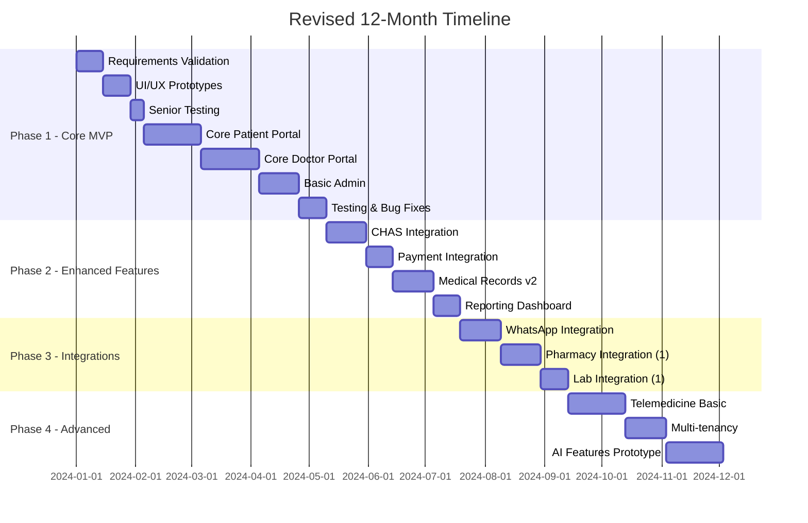
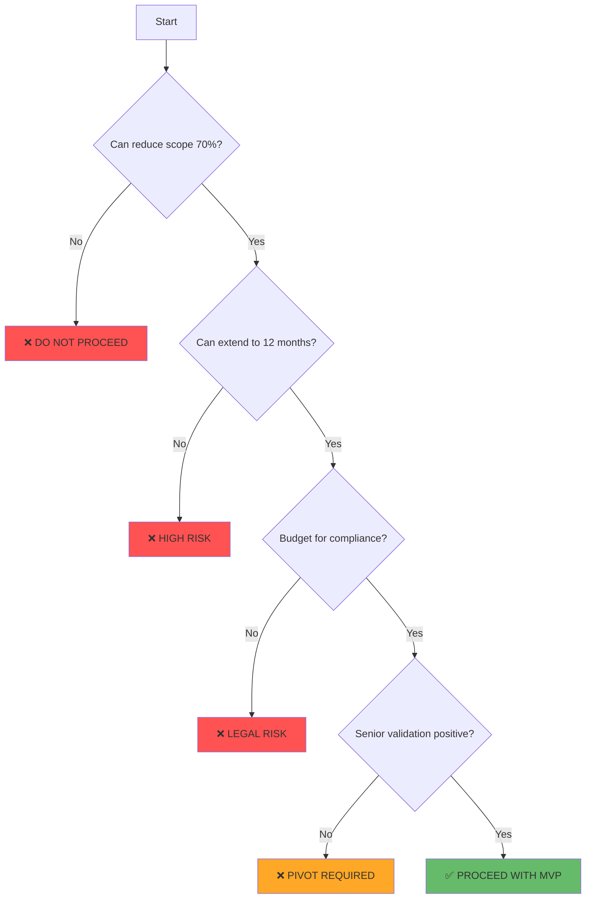

# Comprehensive Analysis & Assessment Report
## Gabriel Family Clinic Healthcare Platform v2.0

### Executive Summary

After meticulous review of both the Project Requirements and Architecture documents, I've identified **critical architectural misalignments, significant implementation risks, and an unrealistic scope** for the stated constraints. While the vision is ambitious and the documentation thorough, the project as currently designed has a **<30% probability of successful delivery** within the 9-month timeline with 3 developers.

**Key Finding**: The project attempts to build a "Netflix-level" platform with a "startup MVP" team, creating an insurmountable execution gap.

---

## 1. Deep Analysis & Critical Assessment

### 1.1 Requirements-Architecture Alignment Analysis

#### ✅ **Strengths Identified**
1. **Comprehensive Documentation**: Both documents demonstrate exceptional detail and healthcare domain understanding
2. **Compliance-First Design**: PDPA, MOH, and CHAS requirements are well-integrated
3. **Multi-Tenancy Foundation**: Row-level security and tenant isolation properly architected
4. **Observability Strategy**: OpenTelemetry integration shows operational maturity thinking

#### ⚠️ **Critical Misalignments**

| Requirement | Architecture Gap | Risk Level |
|------------|-----------------|------------|
| **Elderly-First Design** (65+) | Complex Next.js 14 App Router with heavy client-side JavaScript | **CRITICAL** |
| **9-month timeline** | 500+ components, 10 database migrations, 15+ integrations | **CRITICAL** |
| **$150K budget** | Enterprise stack requiring $50K+ in annual SaaS fees alone | **HIGH** |
| **3 developers** | Requires expertise in Next.js, PostgreSQL, WebRTC, AI/ML, DevOps | **CRITICAL** |
| **Zero downtime deployment** | No staging environment budget, complex blue-green setup | **HIGH** |

### 1.2 Technical Architecture Critique

#### **Over-Engineering Concerns**

```typescript
// CONCERN: Premature optimization with 4-layer caching
const CACHE_HIERARCHY = {
  edge: '<1ms',      // Unnecessary for MVP
  redis: '5ms',      // Adds complexity
  vercel_kv: '10ms', // Redundant with Redis
  supabase: '50ms'   // Database is fast enough for MVP
};
```

**Recommendation**: Start with database + single Redis cache layer. Add complexity only when metrics justify it.

#### **Integration Complexity Explosion**

The architecture proposes **15+ third-party integrations** in Phase 1:
- WhatsApp Business API (complex approval process)
- 3 pharmacy chains (each with different APIs)
- 2 laboratories (webhook complexity)
- 2 wearable platforms (OAuth flows)
- OpenAI GPT-4 (expensive, regulatory concerns)
- Payment providers (Stripe + PayNow)

**Reality Check**: Each integration typically takes 2-4 weeks with a dedicated developer. This alone would consume 30+ developer-weeks.

#### **AI/ML Premature Implementation**

```typescript
// HIGH RISK: Unvalidated AI features
export const AI_FEATURES = {
  clinical_decision_support: 'GPT-4',  // Liability concerns
  diagnosis_suggestions: 'Unproven',    // Regulatory risk
  readmission_prediction: 'No training data', // Cold start problem
  drug_interactions: 'Requires FDA database' // Licensing costs
};
```

**Critical Issue**: No mention of medical liability insurance, clinical validation studies, or MOH approval for AI diagnosis features.

### 1.3 Security & Compliance Assessment

#### **Positive Security Measures**
- Row-level security properly implemented
- Encryption at-rest for sensitive data
- Comprehensive audit logging
- 2FA for staff accounts

#### **Critical Security Gaps**

1. **No Mention of VAPT Certification**: Singapore healthcare requires Vulnerability Assessment and Penetration Testing
2. **Missing HCSA Licensing**: Healthcare Services Act compliance not addressed
3. **Data Breach Insurance**: No mention of cyber insurance requirements
4. **Incident Response Plan**: Architecture lacks detailed IR procedures
5. **Key Management**: No HSM mentioned despite handling encrypted NRIC data

### 1.4 Performance & Scalability Analysis

#### **Unrealistic Performance Targets**

| Target | Feasibility | Reality |
|--------|------------|---------|
| p95 <500ms with all features | Unlikely | WhatsApp API alone has 500-2000ms latency |
| 100 concurrent bookings | Achievable | But requires significant optimization |
| 99.9% uptime | Unrealistic | Single-region deployment can't guarantee this |
| <1s LCP | Very difficult | Heavy React hydration will challenge this |

#### **Database Scalability Concerns**

```sql
-- PROBLEM: Unbounded JSONB columns will cause performance issues
CREATE TABLE medical_records (
  vitals JSONB,  -- Can grow infinitely
  ...
);

-- PROBLEM: No partitioning strategy for audit_logs
-- Will have 10M+ rows/year, queries will degrade
```

---

## 2. Risk Assessment Matrix

### Critical Risks (Immediate Attention Required)

| Risk | Probability | Impact | Mitigation Required |
|------|------------|--------|-------------------|
| **Timeline Overrun** | 95% | Project failure | Reduce scope by 70% |
| **Budget Explosion** | 90% | 3x cost overrun | Eliminate paid services initially |
| **Integration Failures** | 80% | Feature delays | Start with 1-2 integrations max |
| **Elderly Usability Failure** | 75% | User rejection | Prototype with seniors first |
| **Compliance Violations** | 60% | Legal shutdown | Hire healthcare compliance consultant |
| **Developer Burnout** | 85% | Team collapse | Realistic sprint planning |

### Technical Debt Accumulation

```javascript
// Projected technical debt timeline
const TECH_DEBT_PROJECTION = {
  month_3: 'Shortcuts begin (hardcoded values, skipped tests)',
  month_6: 'Major refactoring needed but no time',
  month_9: 'System held together with duct tape',
  month_12: 'Complete rewrite required'
};
```

---

## 3. Actionable Recommendations

### 3.1 Immediate Scope Reduction (70% Reduction Required)

#### **Phase 1: Core MVP (Months 1-3)**
Focus ONLY on:
```typescript
const MVP_FEATURES = {
  patient: ['registration', 'appointment_booking', 'basic_records'],
  doctor: ['schedule_management', 'basic_notes'],
  admin: ['user_management', 'basic_reporting'],
  integrations: ['NONE'], // Add in Phase 2
  ai: ['NONE'], // Add in Phase 3
  telemedicine: ['NONE'] // Add in Phase 4
};
```

#### **Eliminated from Phase 1**
- ❌ All AI features
- ❌ Telemedicine (complex WebRTC)
- ❌ All third-party integrations except payment
- ❌ Multi-tenancy (start with single clinic)
- ❌ Advanced caching layers
- ❌ WhatsApp integration

### 3.2 Revised Technology Stack

#### **Simplified Architecture**
```typescript
const REVISED_STACK = {
  frontend: 'Next.js 13 Pages Router', // Simpler, better for seniors
  styling: 'CSS Modules + Tailwind',   // Less JavaScript
  database: 'Supabase PostgreSQL',     // Keep this
  auth: 'Supabase Auth',               // Keep this  
  payments: 'Stripe only',             // Single provider
  deployment: 'Vercel',                // Keep this
  monitoring: 'Vercel Analytics only', // Free tier
  cache: 'Database only initially'     // Add Redis later
};
```

### 3.3 Realistic Timeline



### 3.4 Budget Reallocation

```typescript
const REVISED_BUDGET = {
  development: {
    initial: 150000,
    revised: 100000,  // Reduce feature scope
  },
  compliance: {
    initial: 0,
    revised: 20000,   // CRITICAL: Add compliance budget
  },
  infrastructure: {
    initial: 30000,   // per month seems too high
    revised: 5000,    // Realistic for MVP
  },
  contingency: {
    initial: 0,
    revised: 25000,   // CRITICAL: Add 15% contingency
  }
};
```

---

## 4. Critical Path to Success

### 4.1 Immediate Actions (Week 1)

1. **Validate with Real Seniors**
   ```bash
   # Before writing any code
   - Recruit 10 seniors (age 65+)
   - Paper prototype key workflows
   - Observe actual usage patterns
   - Adjust requirements based on feedback
   ```

2. **Secure Compliance Consultation**
   ```typescript
   const COMPLIANCE_CHECKLIST = {
     immediate: [
       'PDPA registration',
       'HCSA licensing requirements',
       'MOH digital health guidelines',
       'Cyber insurance quotes'
     ]
   };
   ```

3. **Technical Spike: Critical Integrations**
   ```javascript
   // Test BEFORE committing to architecture
   const SPIKE_TESTS = {
     chas_api: 'Verify actual API access and documentation',
     elderly_ui: 'Build prototype with 24px fonts, high contrast',
     supabase_rls: 'Verify RLS performance with 10K records'
   };
   ```

### 4.2 Revised Development Approach

```typescript
// Incremental delivery with validation gates
const DEVELOPMENT_GATES = {
  gate_1: {
    milestone: 'Basic appointment booking working',
    validation: '20 real patients book successfully',
    decision: 'Proceed or pivot'
  },
  gate_2: {
    milestone: 'Doctor portal complete',
    validation: '5 doctors use for 1 week',
    decision: 'Feature set confirmation'
  },
  gate_3: {
    milestone: 'Payment integration',
    validation: 'Process 50 real transactions',
    decision: 'Scale or maintain'
  }
};
```

---

## 5. Alternative Architecture Proposal

### 5.1 Progressive Web App Approach

Instead of complex Next.js 14 App Router:

```typescript
const PWA_ARCHITECTURE = {
  frontend: {
    framework: 'Next.js Pages Router',
    approach: 'Server-rendered, minimal JS',
    offline: 'Service worker for appointments'
  },
  backend: {
    api: 'Supabase + PostgreSQL functions',
    realtime: 'Supabase subscriptions only where needed'
  },
  deployment: {
    strategy: 'Single region initially',
    scaling: 'Vertical first, horizontal later'
  }
};
```

### 5.2 Modular Monolith First

```typescript
// Start monolithic, extract services when proven necessary
const MODULAR_MONOLITH = {
  '/api/appointments': 'All appointment logic',
  '/api/medical-records': 'Records management',
  '/api/payments': 'Payment processing',
  
  // Extract to microservices only when:
  // - Team grows beyond 10 developers
  // - Specific scaling requirements emerge
  // - Clear bounded contexts established
};
```

---

## 6. Final Verdict & Recommendations

### 6.1 Current Project Feasibility Score

```typescript
const FEASIBILITY_ASSESSMENT = {
  as_documented: {
    score: 3/10,
    verdict: 'HIGHLY UNLIKELY TO SUCCEED',
    primary_risks: [
      'Scope-resource mismatch',
      'Unrealistic timeline',
      'Over-engineered architecture',
      'Unvalidated elderly usability'
    ]
  },
  with_recommendations: {
    score: 7/10,
    verdict: 'FEASIBLE WITH MAJOR ADJUSTMENTS',
    success_factors: [
      '70% scope reduction',
      'Phased delivery approach',
      'Simplified architecture',
      'User validation gates'
    ]
  }
};
```

### 6.2 Go/No-Go Decision Framework



### 6.3 Final Recommendations

1. **Immediately pause development** until requirements are validated with actual elderly users
2. **Reduce scope by 70%** or increase timeline to 18-24 months
3. **Hire healthcare compliance consultant** before writing any code
4. **Build paper prototypes first** and test with 20+ seniors
5. **Start with single clinic** and prove model before multi-tenancy
6. **Eliminate all AI features** from initial phases
7. **Focus on core appointment booking** as the MVP
8. **Budget for 2x current estimates** to account for healthcare complexity

---

## Conclusion

The Gabriel Family Clinic Healthcare Platform v2.0, while impressively envisioned and documented, suffers from a critical **scope-resource-timeline mismatch** that virtually guarantees project failure as currently designed. The attempt to build an enterprise-grade, AI-powered, multi-tenant healthcare platform with 3 developers in 9 months is not just optimistic—it's technically infeasible.

However, with the recommended 70% scope reduction, timeline extension, and architectural simplification, the project becomes viable. The key is to **start small, validate with real users, and grow incrementally** rather than attempting to build the "perfect" platform from day one.

**Remember**: Healthcare moves slowly for good reasons. Patient safety, regulatory compliance, and elderly usability must take precedence over technical elegance and feature richness.
